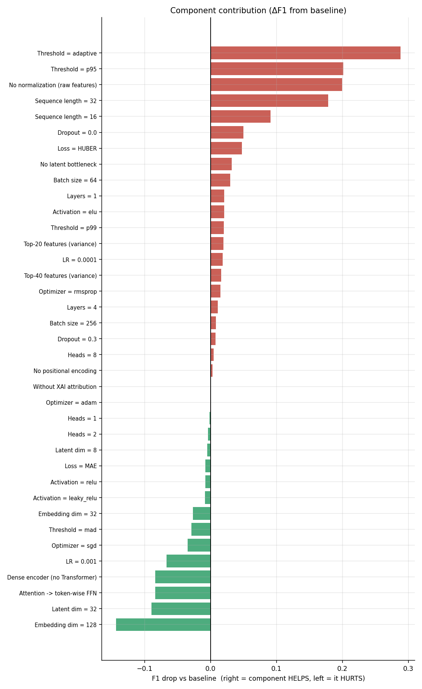
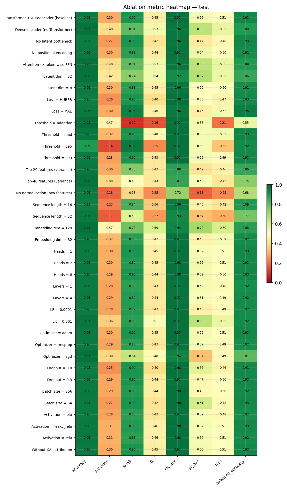
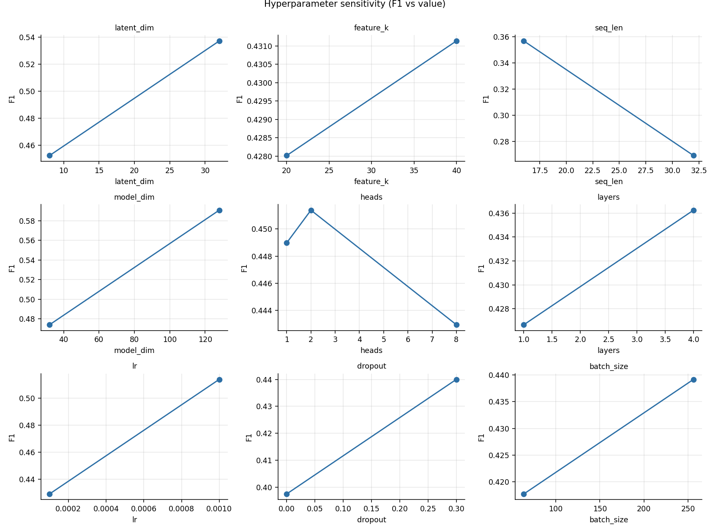
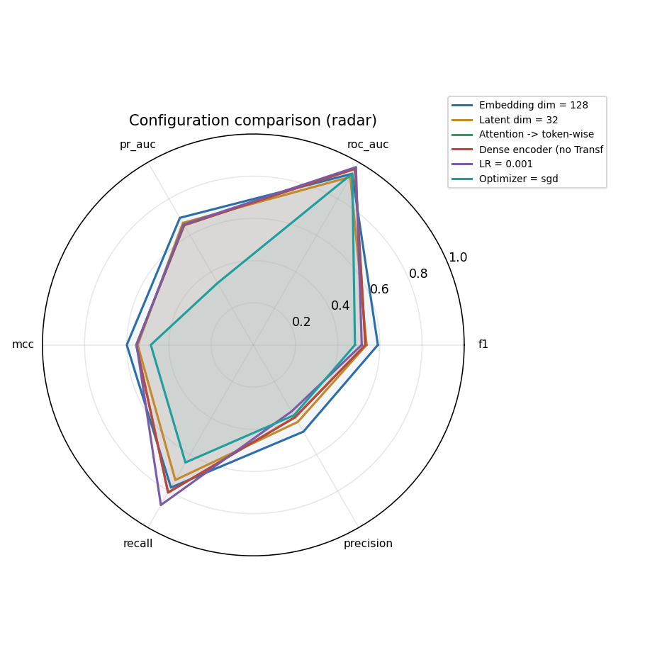
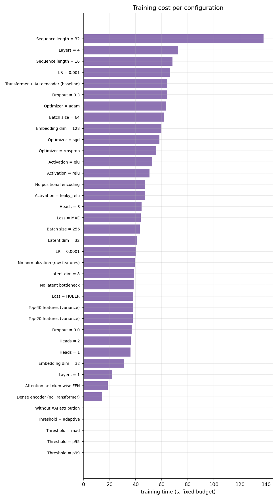

# Ablation & Contribution Study — Transformer Autoencoder

*Generated 2026-07-07 05:14 · leak-free protocol · held-out test · fixed ablation budget*

## 1. Methodology

Every experiment changes **exactly one** component of the proposed model and is evaluated on the **same** leak-free train/val/test split, the same preprocessing, the same metrics, and the same fixed random seed as the Phase-1 benchmark. A deliberately small, fixed training budget is used so that **relative** effects (ΔF1) are comparable across experiments; absolute numbers are lower than a fully-trained model by design. Threshold-strategy and XAI experiments reuse the baseline's trained weights (no component of the model changes).

## 2. Full results (held-out test, sorted by F1)

| label | component | f1 | roc_auc | pr_auc | mcc | params | latency_ms |
|---|---|---|---|---|---|---|---|
| Embedding dim = 128 | Embedding size | 0.5907 | 0.9370 | 0.6960 | 0.6000 | 291173 | 0.0542 |
| Latent dim = 32 | Latent dim | 0.5373 | 0.9197 | 0.6683 | 0.5481 | 115189 | 0.033 |
| Attention -> token-wise FFN | Self-attention | 0.5315 | 0.9642 | 0.6555 | 0.5549 | 46565 | 0.013 |
| Dense encoder (no Transformer) | Transformer encoder | 0.5315 | 0.9642 | 0.6555 | 0.5549 | 46565 | 0.0102 |
| LR = 0.001 | Learning rate | 0.5141 | 0.9735 | 0.6600 | 0.5534 | 113125 | 0.0628 |
| Optimizer = sgd | Optimizer | 0.4821 | 0.9381 | 0.3389 | 0.4861 | 113125 | 0.0447 |
| Threshold = mad | Threshold strategy | 0.4765 | 0.9749 | 0.5253 | 0.5286 | 113125 | 0.0282 |
| Embedding dim = 32 | Embedding size | 0.4741 | 0.9709 | 0.4640 | 0.5212 | 48677 | 0.0228 |
| Activation = leaky_relu | Activation | 0.4561 | 0.9754 | 0.5225 | 0.5095 | 113125 | 0.0327 |
| Activation = relu | Activation | 0.4555 | 0.9755 | 0.5212 | 0.5063 | 113125 | 0.0568 |
| Loss = MAE | Reconstruction loss | 0.4554 | 0.9592 | 0.4530 | 0.5197 | 113125 | 0.0439 |
| Latent dim = 8 | Latent dim | 0.4523 | 0.9637 | 0.4997 | 0.5037 | 112093 | 0.0242 |
| Heads = 2 | Attention heads | 0.4514 | 0.9757 | 0.5275 | 0.5056 | 113125 | 0.0305 |
| Heads = 1 | Attention heads | 0.4490 | 0.9747 | 0.5180 | 0.5064 | 113125 | 0.032 |
| Without XAI attribution | XAI (Integrated Gradients) | 0.4475 | 0.9749 | 0.5253 | 0.5052 | 113125 | 0.0527 |
| Optimizer = adam | Optimizer | 0.4475 | 0.9748 | 0.5246 | 0.5052 | 113125 | 0.0528 |
| Transformer + Autoencoder (baseline) | Full proposed model | 0.4475 | 0.9749 | 0.5253 | 0.5052 | 113125 | 0.0527 |
| No positional encoding | Positional encoding | 0.4444 | 0.9706 | 0.5427 | 0.4974 | 113125 | 0.0293 |
| Heads = 8 | Attention heads | 0.4430 | 0.9763 | 0.5242 | 0.5016 | 113125 | 0.0374 |
| Dropout = 0.3 | Dropout | 0.4400 | 0.9677 | 0.4731 | 0.4992 | 113125 | 0.0551 |
| Batch size = 256 | Batch size | 0.4392 | 0.9756 | 0.4772 | 0.4958 | 113125 | 0.0358 |
| Layers = 4 | Transformer layers | 0.4362 | 0.9724 | 0.5119 | 0.4934 | 213093 | 0.0767 |
| Optimizer = rmsprop | Optimizer | 0.4324 | 0.9719 | 0.5173 | 0.4877 | 113125 | 0.0414 |
| Top-40 features (variance) | Feature selection | 0.4311 | 0.8655 | 0.5186 | 0.4225 | 107320 | 0.0498 |
| LR = 0.0001 | Learning rate | 0.4290 | 0.9729 | 0.4555 | 0.4876 | 113125 | 0.042 |
| Top-20 features (variance) | Feature selection | 0.4280 | 0.8788 | 0.4158 | 0.4602 | 104740 | 0.0734 |
| Threshold = p99 | Threshold strategy | 0.4272 | 0.9749 | 0.5253 | 0.4888 | 113125 | 0.0282 |
| Layers = 1 | Transformer layers | 0.4267 | 0.9710 | 0.5213 | 0.4830 | 63141 | 0.0301 |
| Activation = elu | Activation | 0.4267 | 0.9705 | 0.5183 | 0.4830 | 113125 | 0.0376 |
| Batch size = 64 | Batch size | 0.4177 | 0.9765 | 0.6109 | 0.4812 | 113125 | 0.0873 |
| No latent bottleneck | Autoencoder bottleneck | 0.4151 | 0.9626 | 0.4368 | 0.4791 | 110997 | 0.0279 |
| Loss = HUBER | Reconstruction loss | 0.4000 | 0.9769 | 0.5013 | 0.4668 | 113125 | 0.0447 |
| Dropout = 0.0 | Dropout | 0.3976 | 0.9757 | 0.5718 | 0.4648 | 113125 | 0.053 |
| Sequence length = 16 | Sequence length | 0.3566 | 0.9563 | 0.4575 | 0.4193 | 113125 | 0.0542 |
| Sequence length = 32 | Sequence length | 0.2692 | 0.9294 | 0.3360 | 0.3043 | 113125 | 0.1145 |
| No normalization (raw features) | Normalization | 0.2478 | 0.7193 | 0.1822 | 0.2452 | 113125 | 0.0265 |
| Threshold = p95 | Threshold strategy | 0.2460 | 0.9749 | 0.5253 | 0.3451 | 113125 | 0.0282 |
| Threshold = adaptive | Threshold strategy | 0.1591 | 0.9749 | 0.5253 | 0.2055 | 113125 | 0.0282 |

## 3. Contribution ranking

| Rank | Component | Max ΔF1 when ablated | Worst variant | F1 95% CI |
|---|---|---|---|---|
| 1 | Threshold strategy | +0.2884 | Threshold = adaptive | [0.067, 0.267] |
| 2 | Normalization | +0.1997 | No normalization (raw features) | [0.164, 0.316] |
| 3 | Sequence length | +0.1782 | Sequence length = 32 | [0.184, 0.369] |
| 4 | Dropout | +0.0499 | Dropout = 0.0 | [0.334, 0.474] |
| 5 | Reconstruction loss | +0.0475 | Loss = HUBER | [0.342, 0.473] |
| 6 | Autoencoder bottleneck | +0.0324 | No latent bottleneck | [0.343, 0.483] |
| 7 | Batch size | +0.0297 | Batch size = 64 | [0.352, 0.497] |
| 8 | Transformer layers | +0.0208 | Layers = 1 | [0.352, 0.501] |
| 9 | Activation | +0.0208 | Activation = elu | [0.353, 0.500] |
| 10 | Feature selection | +0.0194 | Top-20 features (variance) | [0.346, 0.509] |
| 11 | Learning rate | +0.0184 | LR = 0.0001 | [0.364, 0.499] |
| 12 | Optimizer | +0.0150 | Optimizer = rmsprop | [0.358, 0.502] |
| 13 | Attention heads | +0.0045 | Heads = 8 | [0.373, 0.511] |
| 14 | Positional encoding | +0.0030 | No positional encoding | [0.368, 0.524] |
| 15 | XAI (Integrated Gradients) | +0.0000 | Without XAI attribution | [0.378, 0.517] |
| 16 | Latent dim | -0.0048 | Latent dim = 8 | [0.379, 0.526] |
| 17 | Embedding size | -0.0266 | Embedding dim = 32 | [0.391, 0.546] |
| 18 | Transformer encoder | -0.0841 | Dense encoder (no Transformer) | [0.448, 0.620] |
| 19 | Self-attention | -0.0841 | Attention -> token-wise FFN | [0.448, 0.620] |

## 4. Automatic conclusions (measured only)

The full proposed configuration reached F1 = 0.447 on the held-out test split under the fixed ablation budget. Measured component contributions (ΔF1 when ablated):
- **Threshold strategy**: ablating it (Threshold = adaptive) REDUCED F1 by 0.288 → necessary — keep.
- **Normalization**: ablating it (No normalization (raw features)) REDUCED F1 by 0.200 → necessary — keep.
- **Sequence length**: ablating it (Sequence length = 32) REDUCED F1 by 0.178 → necessary — keep.
- **Dropout**: ablating it (Dropout = 0.0) REDUCED F1 by 0.050 → necessary — keep.
- **Reconstruction loss**: ablating it (Loss = HUBER) REDUCED F1 by 0.047 → necessary — keep.
- **Autoencoder bottleneck**: ablating it (No latent bottleneck) REDUCED F1 by 0.032 → necessary — keep.
- **Batch size**: ablating it (Batch size = 64) REDUCED F1 by 0.030 → necessary — keep.
- **Transformer layers**: ablating it (Layers = 1) REDUCED F1 by 0.021 → necessary — keep.
- **Activation**: ablating it (Activation = elu) REDUCED F1 by 0.021 → necessary — keep.
- **Feature selection**: ablating it (Top-20 features (variance)) REDUCED F1 by 0.019 → necessary — keep.
- **Learning rate**: ablating it (LR = 0.0001) REDUCED F1 by 0.018 → necessary — keep.
- **Optimizer**: ablating it (Optimizer = rmsprop) REDUCED F1 by 0.015 → necessary — keep.
- **Attention heads**: ablating it (Heads = 8) changed F1 by only +0.005 → not decisive at this budget.
- **Positional encoding**: ablating it (No positional encoding) changed F1 by only +0.003 → not decisive at this budget.
- **XAI (Integrated Gradients)**: ablating it (Without XAI attribution) changed F1 by only +0.000 → not decisive at this budget.
- **Latent dim**: ablating it (Latent dim = 8) changed F1 by only -0.005 → not decisive at this budget.
- **Embedding size**: ablating it (Embedding dim = 32) IMPROVED F1 by 0.027 when changed → candidate to revisit.
- **Transformer encoder**: ablating it (Dense encoder (no Transformer)) IMPROVED F1 by 0.084 when changed → candidate to revisit.
- **Self-attention**: ablating it (Attention -> token-wise FFN) IMPROVED F1 by 0.084 when changed → candidate to revisit.

The single most important component is **Threshold strategy** (largest F1 loss, 0.288, when ablated as 'Threshold = adaptive').

## 5. Figures

## 6. Limitations

- Fixed reduced budget: absolute F1 is lower than a fully-trained model; only relative deltas are interpreted.
- Single synthetic dataset: contribution magnitudes may differ on real data.
- Supervised paradigms are excluded here (this study ablates the proposed unsupervised architecture only).
