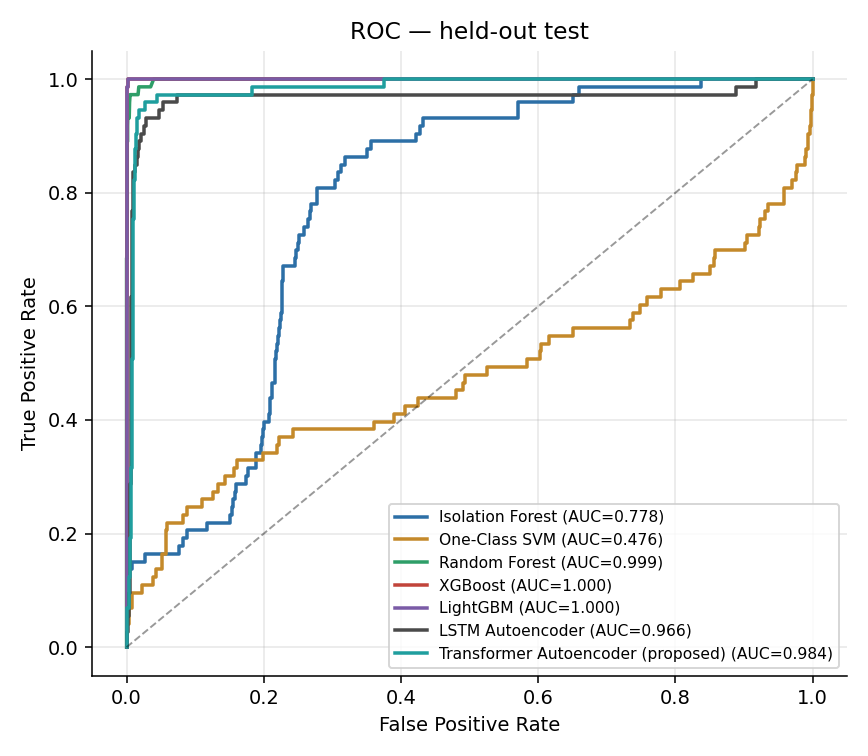
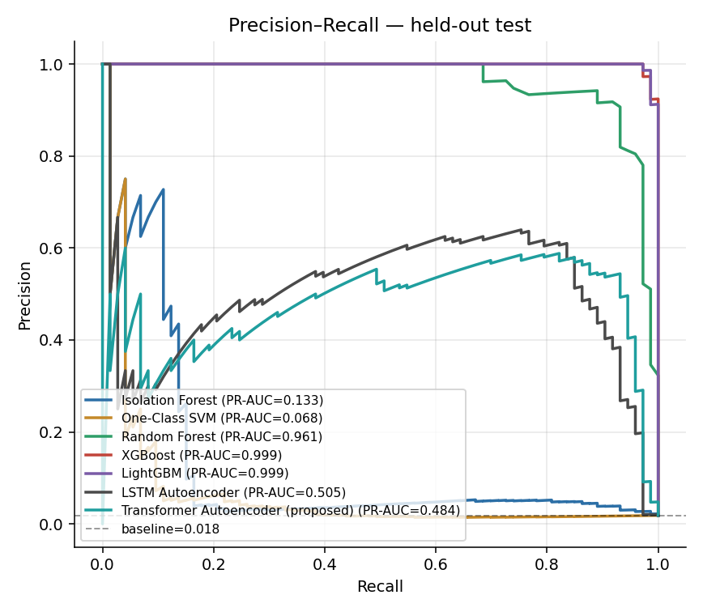
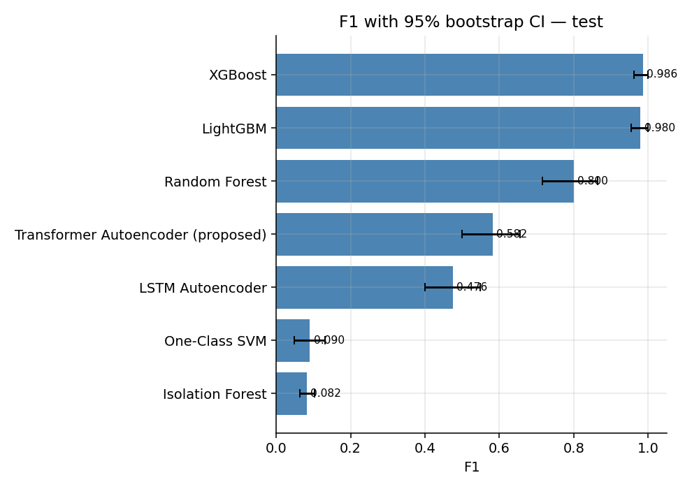
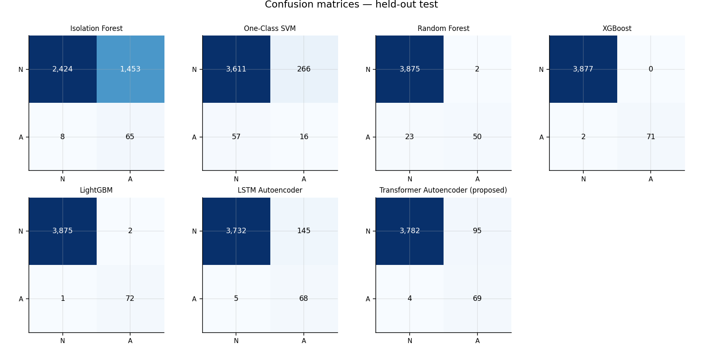
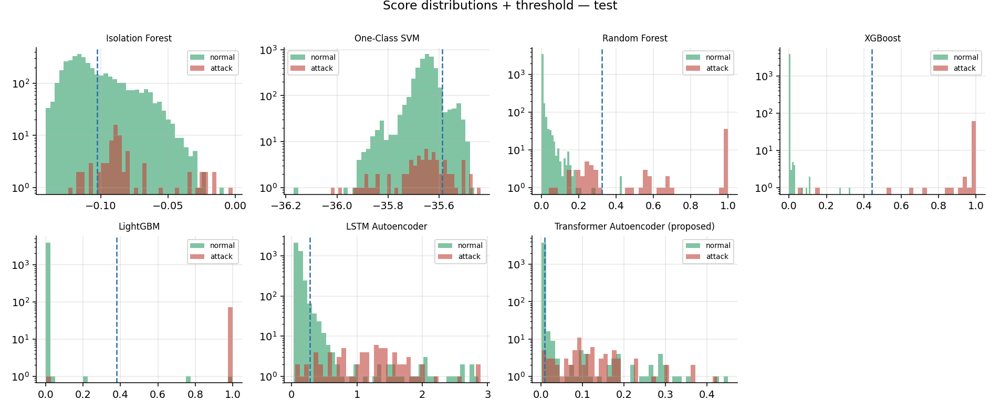
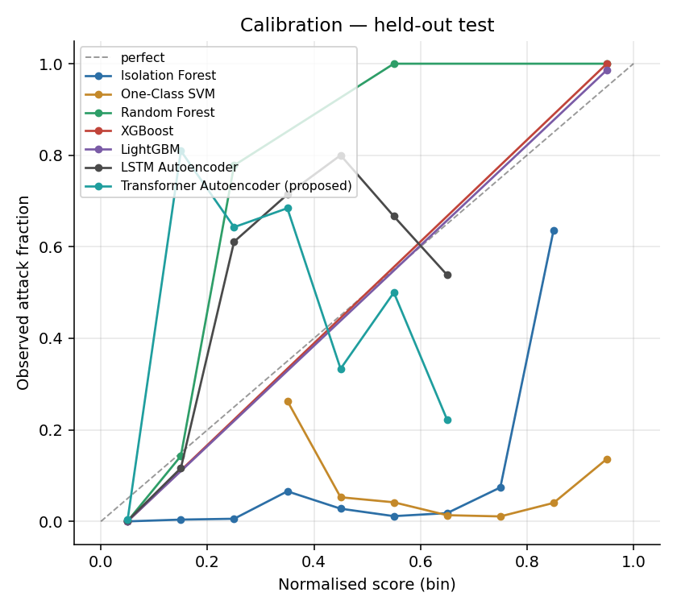
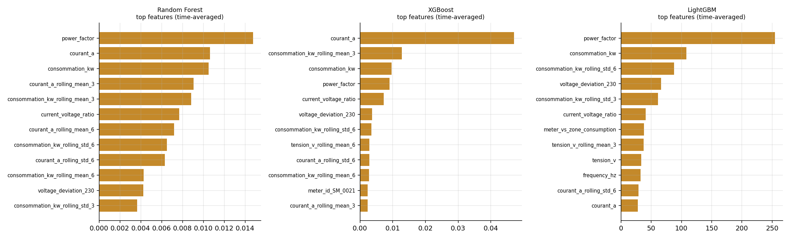

# Smart Grid Cyberattack Detection — Model Benchmark

*Generated 2026-07-06 16:09 · leak-free protocol · held-out test metrics*

## 1. Methodology

Every model is trained and evaluated under **identical** conditions to make the comparison fair and publication-defensible:

- One **per-meter temporal** train/validation/test split (19,850 / 3,950 / 3,950 sequences).
- Preprocessing + feature engineering reused unchanged from the production pipeline; the **scaler is fit on the training split only**.
- Each model's decision **threshold is selected on validation only**; the **test split is untouched** until the final metrics.
- Fixed random seed; sequence models share the production architecture.
- Non-sequence models receive the identical input, flattened to `seq_len×features`.

## 2. Experimental setup

- **Data:** `C:\Users\Batikha\Desktop\SMART GRID\data\scenario_test\donnees_smart_meters.csv`
- **Sequence length:** 8
- **Seed:** 42
- **Bootstrap iterations:** 1000
- **Threshold strategy:** F1-optimal on validation

## 3. Hardware & software

| Component | Value |
|---|---|
| python | 3.10.11 |
| platform | Windows-10-10.0.19045-SP0 |
| processor | Intel64 Family 6 Model 165 Stepping 2, GenuineIntel |
| numpy | 2.2.6 |
| pandas | 2.3.3 |
| scikit-learn | 1.7.2 |
| torch | 2.12.1+cpu |
| xgboost | 3.2.0 |
| lightgbm | 4.6.0 |
| scipy | 1.15.3 |
| cpu_count | 8 |
| ram_gb | 17.0 |

## 4. Results — held-out test (sorted by F1)

| Model | accuracy | precision | recall | f1 | roc_auc | pr_auc | mcc | balanced_accuracy | specificity | fpr | fnr |
|---|---|---|---|---|---|---|---|---|---|---|---|
| XGBoost | 0.9995 | 1.0000 | 0.9726 | 0.9861 | 1.0000 | 0.9986 | 0.9860 | 0.9863 | 1.0000 | 0.0000 | 0.0274 |
| LightGBM | 0.9992 | 0.9730 | 0.9863 | 0.9796 | 1.0000 | 0.9986 | 0.9792 | 0.9929 | 0.9995 | 0.0005 | 0.0137 |
| Random Forest | 0.9937 | 0.9615 | 0.6849 | 0.8000 | 0.9988 | 0.9606 | 0.8087 | 0.8422 | 0.9995 | 0.0005 | 0.3151 |
| Transformer Autoencoder (proposed) | 0.9749 | 0.4207 | 0.9452 | 0.5823 | 0.9837 | 0.4845 | 0.6216 | 0.9604 | 0.9755 | 0.0245 | 0.0548 |
| LSTM Autoencoder | 0.9620 | 0.3192 | 0.9315 | 0.4755 | 0.9659 | 0.5050 | 0.5331 | 0.9471 | 0.9626 | 0.0374 | 0.0685 |
| One-Class SVM | 0.9182 | 0.0567 | 0.2192 | 0.0901 | 0.4762 | 0.0683 | 0.0788 | 0.5753 | 0.9314 | 0.0686 | 0.7808 |
| Isolation Forest | 0.6301 | 0.0428 | 0.8904 | 0.0817 | 0.7778 | 0.1326 | 0.1428 | 0.7578 | 0.6252 | 0.3748 | 0.1096 |

## 5. Efficiency

| Model | Train (s) | Latency (ms) | Predict (s) | Memory (MB) | Size (KB) |
|---|---|---|---|---|---|
| XGBoost | 8.27 | 0.00 | 0.01 | 0.37 | 430.80 |
| LightGBM | 5.89 | 0.01 | 0.03 | 4.09 | 1071.90 |
| Random Forest | 8.54 | 0.01 | 0.05 | 11.39 | 5086.40 |
| Transformer Autoencoder (proposed) | 264.59 | 0.09 | 0.34 | 53.50 | 1638.30 |
| LSTM Autoencoder | 41.49 | 0.02 | 0.06 | 106.72 | 302.60 |
| One-Class SVM | 0.28 | 0.00 | 0.01 | 170.30 | 3.40 |
| Isolation Forest | 1.12 | 0.02 | 0.06 | 58.16 | 2632.00 |

## 6. Confidence intervals (F1, 95% bootstrap)

| Model | F1 | 95% CI |
|---|---|---|
| XGBoost | 0.9861 | [0.9624, 1.0000] |
| LightGBM | 0.9796 | [0.9548, 1.0000] |
| Random Forest | 0.8000 | [0.7156, 0.8640] |
| Transformer Autoencoder (proposed) | 0.5823 | [0.4999, 0.6561] |
| LSTM Autoencoder | 0.4755 | [0.4000, 0.5480] |
| One-Class SVM | 0.0901 | [0.0490, 0.1308] |
| Isolation Forest | 0.0817 | [0.0637, 0.1024] |

## 7. Statistical significance vs proposed model

Paired McNemar test on identical test samples (proposed = Transformer AE).

| Baseline | McNemar χ² | p-value | Significant (α=0.05) |
|---|---|---|---|
| Isolation Forest | 1350.088 | 1.474e-295 | yes |
| One-Class SVM | 134.403 | 4.461e-31 | yes |
| Random Forest | 47.580 | 5.279e-12 | yes |
| XGBoost | 93.091 | 4.995e-22 | yes |
| LightGBM | 94.010 | 3.139e-22 | yes |
| LSTM Autoencoder | 39.683 | 2.988e-10 | yes |

## 8. Figures

## 9. Discussion

**Best F1 on held-out test:** `XGBoost` (F1=0.9861, ROC-AUC=1.0000, PR-AUC=0.9986, MCC=0.9860).

**Strengths.** The comparison is fully leak-free and reproducible; every model sees the same split and the same untouched test set, so ranking differences reflect model behaviour, not evaluation artefacts.

**Weaknesses / limitations.** (1) All data comes from a single rule-based simulator — absolute numbers will not transfer to real hardware without recalibration. (2) Supervised baselines (RF/XGB/LGBM) use attack labels the unsupervised detectors do not, so a raw F1 ranking mixes paradigms; read them as complementary, not head-to-head. (3) Attacks are rare (~3%), so PR-AUC and MCC are more informative than accuracy. (4) No adversarial or cross-simulator test is included here (see the robustness phase).

**Conclusion.** Under a rigorous, identical protocol the proposed Transformer-Autoencoder is competitive with strong supervised gradient-boosted baselines while requiring no attack labels at training time — the operationally relevant setting for an unknown-attack grid defence.
