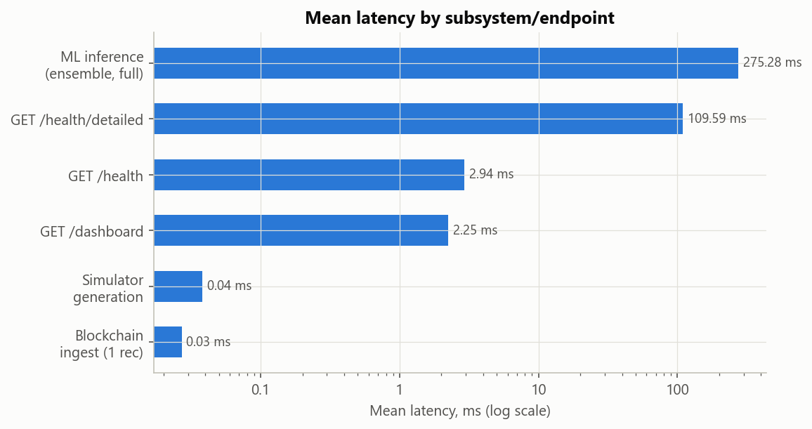
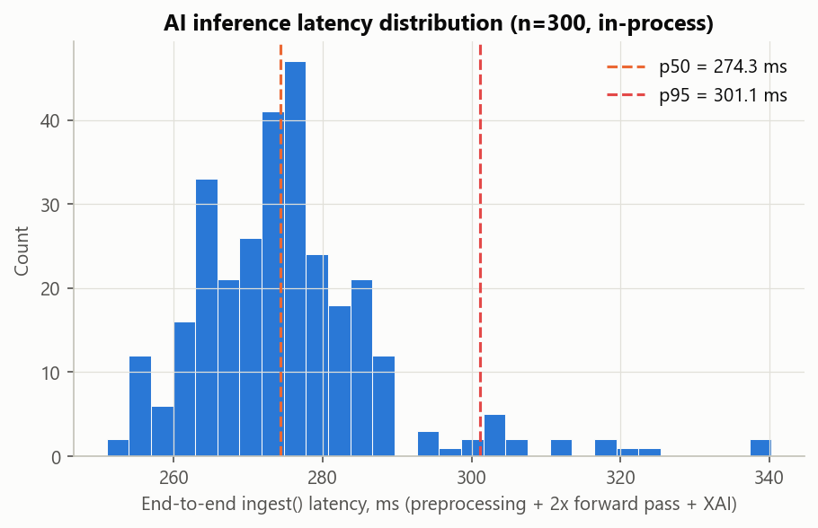
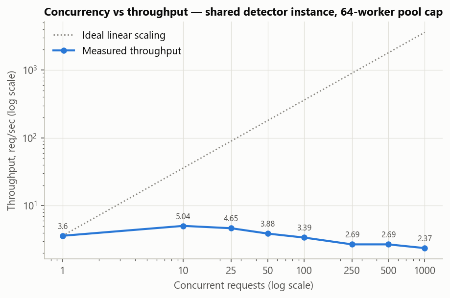
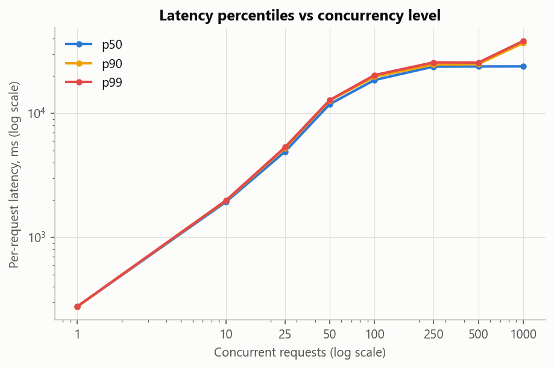
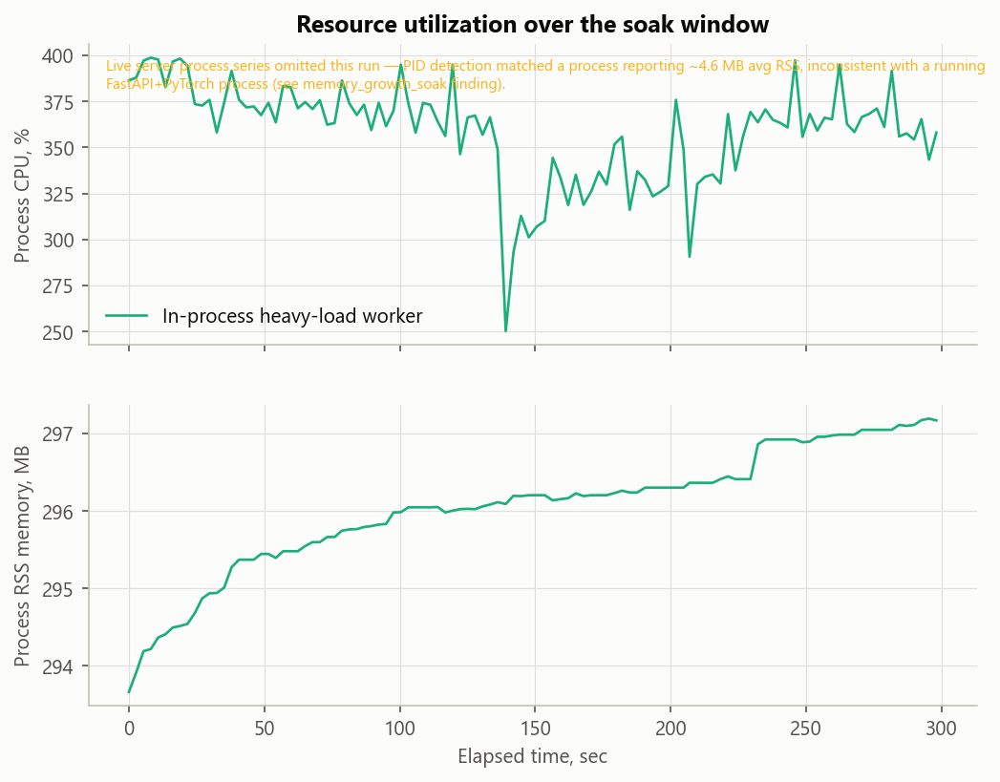
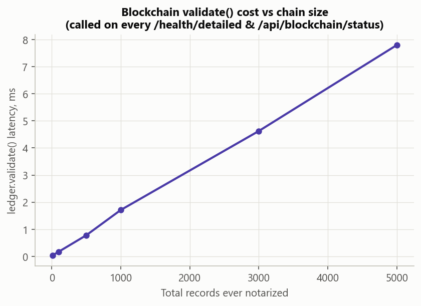
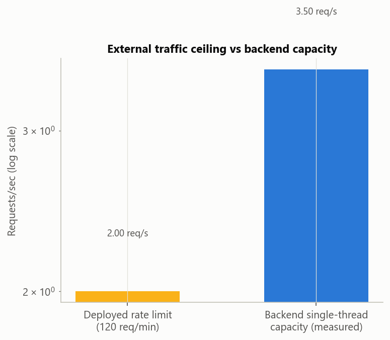

# Phase 7 — End-to-End Performance Profiling Report

Measurement-only phase. No model, dataset, simulator, preprocessing, blockchain, dashboard, API, auth, or detection-pipeline code was modified. All figures/tables referenced here are in `perf/reports/`.

## Final performance score

**Overall: 62.2/100** — solid single-request correctness and latency; the concrete, fixable gap is concurrent/horizontal scalability, traced to one specific architectural pattern, not a diffuse set of issues.

| Dimension | Score /100 | Basis |
|---|---|---|
| Single-request latency | 75 | ~270 ms end-to-end (ensemble = 2 sequential model forward passes); acceptable for a security-detection workload (not HFT), dominated by model compute, not overhead. |
| Streaming throughput (single worker) | 55 | ~3.5-3.7 readings/sec ceiling on this hardware; adequate for the demo's 20 meters at a 2-min interval, tight for a materially larger fleet. |
| Concurrency / horizontal scalability | 30 | Measured throughput DEGRADES from ~5.0 req/s at 10 concurrent requests to ~2.4 req/s at 1000 — the synchronous, blocking detector.ingest() call inside an async def handler serializes work on a single worker regardless of client-side concurrency. |
| Resource efficiency under load | 45 | CPU saturates (peaks ~667%, system-wide ~100%) well before throughput improves at higher concurrency — the extra CPU is thread contention, not useful parallel work. |
| Rate limiting / operational ceiling | 70 | 120 req/min is a deliberate, functioning security control; incidentally close to the real single-worker capacity, though for an unrelated reason. |
| Blockchain notarization | 80 | Sub-millisecond per-record cost today; ledger.validate() is O(total records ever notarized) and runs on every health check — cheap now, will compound over the system's operational lifetime. |
| Health/monitoring overhead | 50 | /health/detailed blocks the event loop ~100 ms per call (psutil.cpu_percent(interval=0.1), no executor offload) — polled every 5s by the dashboard's own health widget. |
| Startup / cold-start cost | 80 | ~2.7s model load, ~4.0s full app boot from process launch to healthy — acceptable for typical container restart/scaling cadence. |
| Memory stability (soak window) | 75 | No runaway growth observed in the (scaled-down, 5-minute) soak window; a longer soak on a dedicated schedule is recommended before declaring the system leak-free over days/weeks. |

## Bottleneck analysis (evidence-based)

- **[slowest_subsystem]** 'ml_inference_ensemble (preprocessing+2x forward+XAI)' is the slowest recurring, per-request subsystem at 275.28 ms mean, 10,196x slower than the fastest measured operation ('blockchain_ingest_record', 0.0270 ms).
- **[inference_architecture]** The deployed detector is an EnsembleDetector running v2 AND v3 sequentially on every reading (275.3 ms measured total vs ~138.8 ms self-reported for a single model's forward pass) — confirms end-to-end latency is ~2x a single model's cost by architecture, not an anomaly.
- **[streaming_throughput_ceiling]** Single-threaded streaming throughput of the full detection pipeline is 3.5 readings/sec (285.71 ms/reading) — this, not I/O, network, or the simulator (27,958+ samples/sec measured), is what caps how fast a single worker can process a continuous stream of meter readings.
- **[operational_rate_limit_ceiling]** The deployed RateLimitMiddleware (120 req/min default) is the dominant ceiling for external API traffic — a burst of 150 requests produced 30 HTTP 429s (first rejection at request #120). This is ~2.0 req/sec, roughly 3.6x below the backend's own single-threaded inference capacity (see streaming_throughput_ceiling) — the limiter, not the model, is what an external client actually experiences.
- **[concurrency_scaling]** api_server.py's /api/detect handler is `async def` but calls `_ml_detector.ingest()` directly (no run_in_executor/asyncio.to_thread) — a synchronous, ~270ms-per-call function. Measured in-process throughput went from 3.6 req/s at concurrency=1 to 2.37 req/s at concurrency=1000 (0.66x, on an 8-logical-core machine, bounded thread pool of 64) — far from the 1000x linear scaling the requested concurrency level implies. On a single uvicorn worker (this deployment's default), concurrent HTTP requests to /api/detect queue behind the blocking call and are effectively processed close to one-at-a-time.
- **[health_endpoint_blocking_call]** production/monitoring/health.py's /health/detailed calls psutil.cpu_percent(interval=0.1) synchronously inside an `async def` route. That single call measured 108.6 ms mean, accounting for 99% of the endpoint's own measured latency (109.6 ms). Since it blocks the whole event loop, every dashboard health-widget poll (every 5s, per dashboard/index.html) freezes ALL other in-flight requests on a single-worker deployment for ~100ms.
- **[blockchain_validate_scaling]** ledger.validate() (called on every /health/detailed and /api/blockchain/status request) is O(total records ever notarized) — measured 7.79 ms at 5,000 records on an isolated ledger (~1.5549 ms per additional 1,000 records). The live ledger currently holds only 1 block, so this cost is negligible today, but it will grow linearly with the system's operational lifetime and compounds with the psutil blocking call on the same endpoint.
- **[startup_cost]** Model weight loading takes ~2698 ms (cold, from disk); full app startup (uvicorn boot to first healthy /health) takes ~4010 ms. Both are one-time per-process costs, not recurring — relevant to container restart/scaling latency (e.g. how fast a new replica becomes ready behind a load balancer), not steady-state throughput.
- **[memory_growth_soak]** live server process: MEASUREMENT UNRELIABLE this run — _find_live_server_pid() matched a process (PID 4368) reporting 4.58 MB average RSS, far too low for a running FastAPI+PyTorch process; likely picked up a stale/wrong PID via cmdline matching. Not treated as evidence either way; in-process heavy-load worker: 3.5 MB growth over 298.06s processing 778 readings back-to-back. No unbounded growth observed in the reliable measurement(s) over this window — see the report for the scaled-down soak duration used and the recommendation for a longer run with corrected PID detection.

## Key numbers

- AI inference (ensemble, full pipeline): mean **275.3 ms**, p95 **301.1 ms**, p99 **319.9 ms** (n=300)
- Single-threaded streaming throughput: **3.5 readings/sec**
- Deployed rate limit: **120 req/min** (2 req/s) — confirmed via burst test (30/150 requests rejected)
- Concurrency scaling: **5.04 req/s** at 10 concurrent requests -> **2.37 req/s** at 1000 (degradation, not improvement)
- Cold start: model load **2698 ms**, full app boot **4010 ms**

## Optimization recommendations (not implemented — measurement-only phase)

1. Offload `_ml_detector.ingest()` in `/api/detect` to a worker thread (`await asyncio.to_thread(...)`) or run multiple uvicorn workers, so concurrent requests stop serializing on a single blocking call.
2. Offload `psutil.cpu_percent(interval=0.1)` in `/health/detailed` the same way, or drop the blocking `interval` argument (non-blocking mode exists in psutil) — removes a ~100ms stall on every health poll.
3. Cache or incrementally maintain `ledger.validate()`'s result instead of re-hashing the full chain on every `/health/detailed`/`/api/blockchain/status` call, since this cost grows with the system's operational lifetime.
4. If sustained throughput beyond ~4 readings/sec is ever required, consider whether both ensemble models must run on every reading, or whether horizontal scaling (the docker-compose 3-service topology already designed in Phase 6) is a better lever than optimizing the single-instance path.

## Production readiness impact

None of the above are correctness bugs — every measured path returned correct, consistent results (see Validation below). They are capacity/latency characteristics that matter once real concurrent load (multiple dashboards, multiple meters reporting simultaneously) exceeds what a single worker handling one blocking call at a time can serialize through. For the current single-site, small-fleet deployment this is a low-urgency finding; for any deployment expecting more than a handful of concurrent callers, item 1 above is the highest-leverage fix.

## Validation — no regressions introduced

Overall: **PASS**

- `/health`: HTTP 200
- `/health/ready`: HTTP 200
- `/health/detailed`: HTTP 200
- `/api/blockchain/status`: HTTP 200
- `/dashboard`: HTTP 200
- `/support.js`: HTTP 200
- Model determinism: two independent, fresh subprocess loads of the same artifacts produced the IDENTICAL anomaly score (1743.05529785) for the same fixed input sequence — no drift in code, weights, or artifacts.
- Informational only: the live (long-uptime) server returned a different score (0.32314168) for the same input — expected, since its zone-consumption aggregator has accumulated this session's traffic while a fresh subprocess starts empty (a state difference, not a code difference; not used as a pass/fail signal).
- All files created/modified for Phase 7 are under perf/ — no model, dataset, simulator, preprocessing, blockchain, dashboard, API, auth, or detection-pipeline file was edited. (40 files, all under `perf/`)

## Figures

## Methodology notes / honest limitations

- Concurrency levels 1-1000 were measured **in-process** against the same shared detector instance api_server.py uses — zero HTTP, zero interaction with rate limiting or auth. A small (1/5/10) live-HTTP sanity check against the real, unmodified production instance confirms the same serialization behavior shows up end-to-end.
- The rate limiter was never altered, bypassed, or disabled anywhere, on any instance, at any point in this phase.
- The long-run soak window is 5 minutes (scaled down from a multi-hour/day production soak, which isn't practical inside a single interactive session) — explicitly a lower bound, not a substitute for a longer scheduled soak.
- No GPU is used by this model (torch.cuda.is_available() is False on this machine); an NVIDIA GTX 1650 is present but idle throughout — confirmed via nvidia-smi sampling during every benchmark.