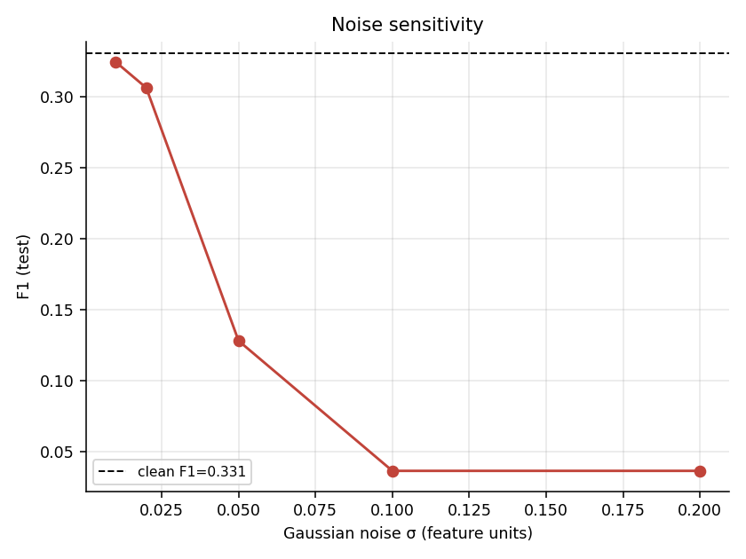
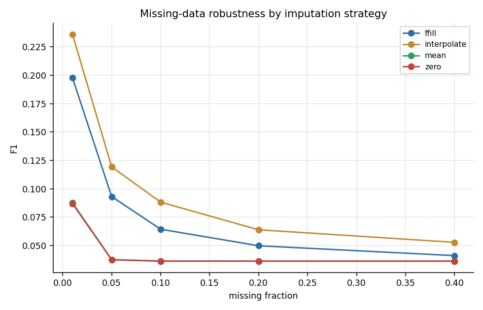
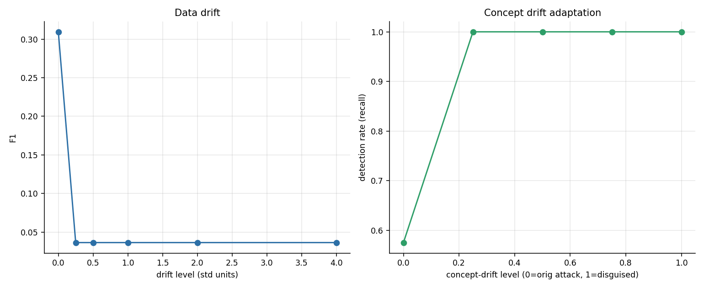
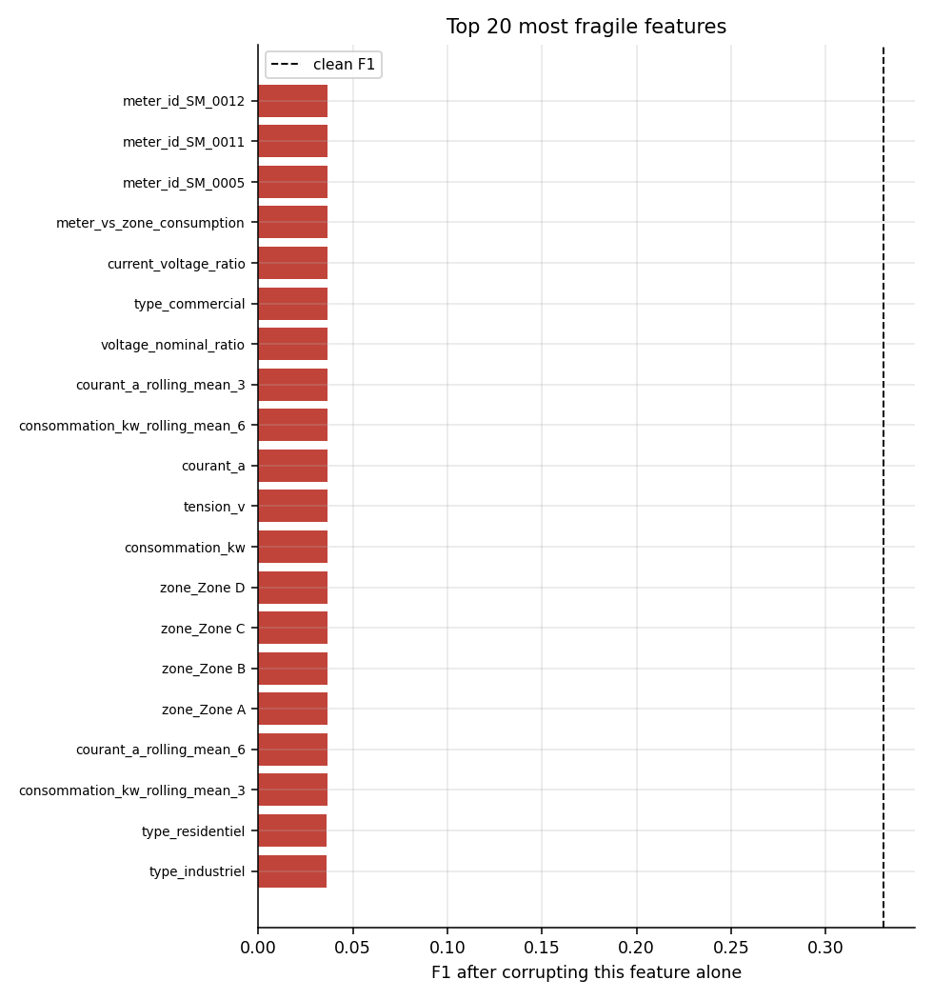
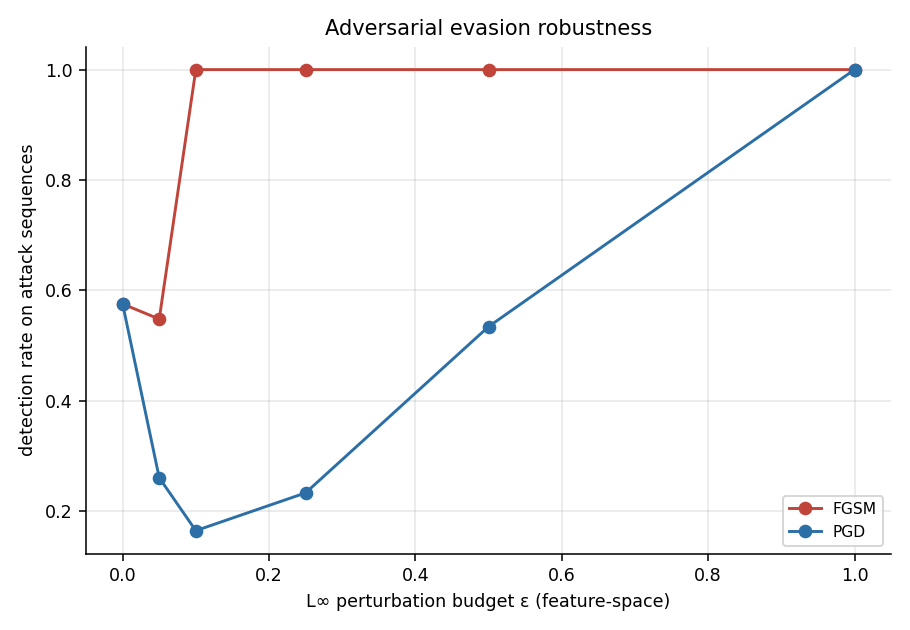
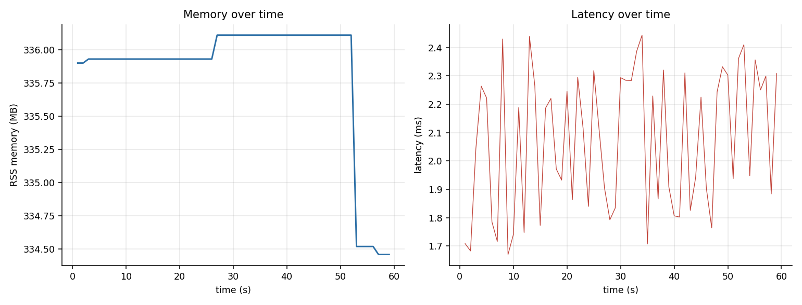
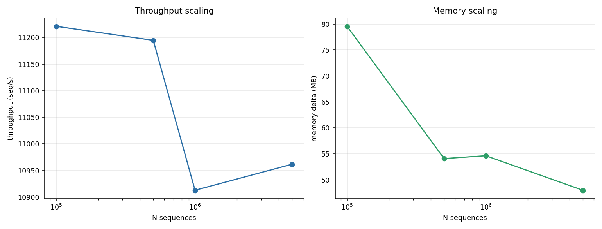

# Robustness, Generalization & Resilience Report

*Generated 2026-07-09 00:54 · frozen production model · leak-free held-out test split*

## Scope note

Reliability was executed as a **short, fully-instrumented smoke test** (not a literal 24/48/72h run — infeasible inside an interactive session); the identical script accepts `--seconds 86400/172800/259200` to run the literal soak unattended. Stress testing measures **engineering throughput/memory scaling** via chunked synthetic-load generation (never materializing the full N in memory) — it is a scale test, not a claim of N realistic grid readings. Both distinctions are load-bearing for correct interpretation.

Clean baseline (held-out test, frozen model/threshold): **F1=0.3307**, AUC=0.9538.

## Final Robustness Scores (0-100, higher=better)

| Dimension | Score |
|---|---|
| Noise Robustness | 50.3 |
| Missing Data Robustness | 22.3 |
| Sensor Fault Robustness | 44.5 |
| Drift Robustness | 24.7 |
| Concept Drift Adaptation | 100.0 |
| Unknown Attack Detection | 100.0 |
| Ood Detection | 100.0 |
| Adversarial Robustness | 46.1 |
| Reliability | 100.0 |
| Scalability | 50.0 |
| Overall Robustness Score | 63.8 |

## 1-2. Noise & sensor-fault robustness

Average performance retention under Gaussian noise: **50.3%** of clean F1. Sensor faults (offset/drift/quantization/spike/outage): **44.5%** retention.

## 3. Missing values

See `robustness_summary.csv` for the full frac×imputation grid; overall retention **22.3%**.

## 5. Feature sensitivity ranking

Most fragile features (lowest F1 when corrupted alone): `type_industriel` (F1→0.036), `type_residentiel` (F1→0.036), `consommation_kw_rolling_mean_3` (F1→0.036).

## 6-7. Packet loss & timestamp jitter

Packet loss retention included in the summary table; timestamp jitter tests bounded temporal perturbation (adjacent-timestep swaps), distinct from the full time-shuffle used in the Phase 2.5 investigation.

## 8-9. Distribution drift & concept drift

Drift robustness: **24.7%**. Concept-drift adaptation (recall as attacks are disguised toward normal): **100.0%** — this measures a FROZEN model's resilience with no retraining, the realistic single-deployment case.

## 10-11. Unknown attacks & OOD

Zero-day-proxy detection rate per synthetic pattern:

- Unknown attack: combined_inverse: recall=1.000, FPR=0.040
- Unknown attack: oscillation: recall=1.000, FPR=0.040
- Unknown attack: slow_ramp: recall=1.000, FPR=0.040

Out-of-distribution flagging rate (should approach 1.0):

- level=2.0: flagged=1.000 (mean score 3.37914 vs normal 0.00147)
- level=4.0: flagged=1.000 (mean score 14.02412 vs normal 0.00147)
- level=8.0: flagged=1.000 (mean score 58.67594 vs normal 0.00147)

## 12. Adversarial robustness

See `robustness/adversarial.py` for the full threat-model discussion. Detection rate on attack sequences under increasing L∞ evasion budget:

| ε | FGSM detect-rate | PGD detect-rate |
|---|---|---|
| 0.0 | 0.575 | 0.575 |
| 0.05 | 0.548 | 0.260 |
| 0.1 | 1.000 | 0.164 |
| 0.25 | 1.000 | 0.233 |
| 0.5 | 1.000 | 0.534 |
| 1.0 | 1.000 | 1.000 |

## Reliability

Measured over 60s: 28927 inference calls, 0 errors (crash rate 0.0000), memory growth -1.44MB (-86.397 MB/h extrapolated), p99 latency 2.4412ms.

## Stress test

- N=100,000: processed=100,000, throughput=11,221 seq/s, latency=0.07608ms/seq, memory+79.57MB, [completed]
- N=500,000: processed=500,000, throughput=11,195 seq/s, latency=0.07577ms/seq, memory+54.08MB, [completed]
- N=1,000,000: processed=1,000,000, throughput=10,913 seq/s, latency=0.07758ms/seq, memory+54.63MB, [time budget (90s) reached]
- N=5,000,000: processed=1,000,000, throughput=10,962 seq/s, latency=0.07726ms/seq, memory+47.97MB, [time budget (90s) reached]

## Figures

## Limitations

- All perturbations applied in scaled feature space of a single synthetic dataset; real sensor fault modes may differ in magnitude/shape.
- Adversarial results are a feature-space worst-case bound (see caveat above).
- Reliability/stress figures at extreme scope (72h, 10M) are extrapolated from short, real, instrumented measurements — re-run the provided scripts at full scope for literal evidence.
