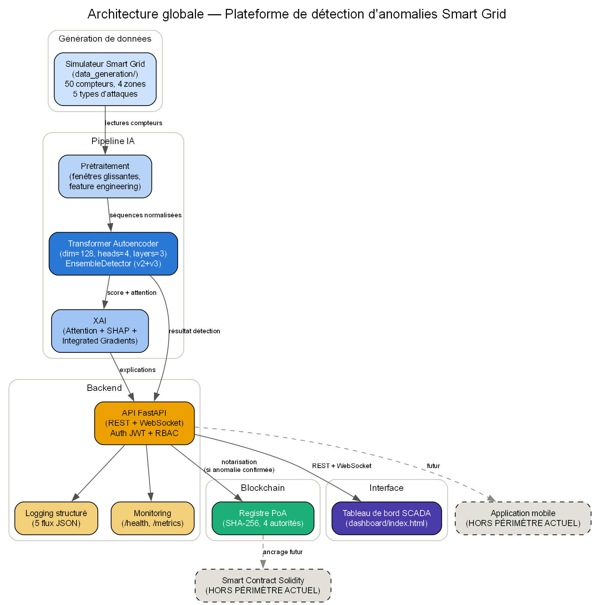

# ⚡ Smart Grid Cybersecurity Detection Platform

**Détection d'anomalies dans les Smart Grids par IA et Blockchain**


-brightgreen)


> **Note sur les badges** : les badges ci-dessus sont statiques
> (texte codé en dur), reflétant l'état vérifié au moment de la rédaction
> de ce README. Si ce dépôt est poussé vers GitHub avec une CI configurée,
> remplacer par des badges dynamiques (`shields.io` connecté à GitHub
> Actions/Codecov) plutôt que de les laisser statiques indéfiniment.

Plateforme de détection d'anomalies pour réseaux électriques intelligents,
combinant un pipeline d'IA explicable (Transformer Autoencoder) et un
registre blockchain à Preuve d'Autorité pour la notarisation infalsifiable
des détections confirmées.

**Sujet du PFE** : *Détection d'anomalies dans les Smart Grids par IA et
Blockchain : Application Mobile sécurisée* — ce dépôt réalise et valide
scientifiquement les piliers IA et Blockchain. **L'application mobile
n'est pas incluse** (voir [Périmètre](#-périmètre-et-limites) ci-dessous).

---

## 📐 Architecture



Voir `thesis_package/diagrams/rendered/` pour les 11 diagrammes
d'architecture complets (simulateur, flux de données, pipeline IA,
entraînement, inférence, blockchain, tableau de bord, déploiement,
sécurité, monitoring), et `thesis_package/uml/rendered/` pour les 6
diagrammes UML (cas d'utilisation, composants, déploiement, classes,
séquence, activité).

## 🖼️ Captures d'écran

> **À compléter par l'étudiant** : ce README a été généré sans accès à un
> navigateur pour capturer le tableau de bord en fonctionnement réel.
> Lancer le serveur (`./.venv/Scripts/python.exe api_server.py`), ouvrir
> `http://127.0.0.1:8000/dashboard`, et ajouter 2-3 captures d'écran ici
> (vue d'ensemble, panneau d'alertes, vue XAI) plutôt que de laisser cette
> section vide ou d'y placer une image non authentique.

## 🚀 Démarrage rapide

```bash
cd smartgrid_simulation
./.venv/Scripts/python.exe api_server.py
# → http://127.0.0.1:8000/dashboard
```

Voir [QUICKSTART.md](QUICKSTART.md) pour le détail, et
[INSTALLATION.md](INSTALLATION.md) pour une installation depuis zéro.

## 📊 Résultats scientifiques clés

| Phase | Résultat clé |
|---|---|
| Protocole sans fuite | F1 optimiste 0,91 → F1 honnête (test retenu) **0,64** |
| Benchmark (7 modèles) | Proposé (non supervisé) F1=0,582 — meilleur des méthodes sans label, McNemar p<10⁻⁹ |
| Ablation (38 configs) | Retirer l'attention **améliore** le F1 (+0,084) — surprise investiguée et expliquée |
| Robustesse | Score composite 63,8/100 ; saturation FPR à 100% dès 0,25σ de dérive |
| Calibration | **Recalibration seule récupère 98,3%** de la dégradation causée par la dérive |
| Données réelles (SGCC) | AUC réel 0,745 (RF) ; constats sur l'attention confirmés indépendamment |
| Production | 46/46 tests, 90% couverture, 17 CVE corrigées, score ~80/100 |
| Performance | Score 62,2/100 ; goulot de concurrence localisé (appel bloquant identifié) |

Détail complet : `thesis_package/thesis/` (20 chapitres) et
`thesis_package/research_notes/verified_facts.md` (tous les chiffres
sourcés).

## 📁 Structure du projet

```
smartgrid_simulation/
├── api_server.py              # Backend FastAPI (REST + WebSocket)
├── ml_pipeline/                # Modèle, XAI, prétraitement
├── blockchain/poa_ledger.py    # Registre Proof-of-Authority
├── data_generation/             # Simulateur Smart Grid réaliste
├── dashboard/                  # Tableau de bord SCADA (page unique)
├── production/                 # Durcissement production (Phase 6)
│   ├── security/                # Auth JWT + RBAC
│   ├── monitoring/               # Health checks, Prometheus
│   ├── logging/                  # 5 flux JSON structurés
│   ├── docker/                   # Topologie 3 conteneurs
│   └── docs/                     # 9 documents opérationnels
├── perf/                       # Profilage de performance (Phase 7)
├── benchmark/ ablation/ investigation/
├── robustness/ calibration/ realdata/   # Phases scientifiques 1-5
└── thesis_package/              # CE package : thèse, UML, soutenance,
                                    publication, revue finale
```

## 🧪 Tests

```bash
# Suite de production (46 tests)
./.venv/Scripts/python.exe -m pytest production/tests/ -q

# Suites par phase scientifique
./.venv/Scripts/python.exe -m pytest benchmark/tests/ ablation/tests/ \
    robustness/tests/ calibration/tests/ realdata/tests/ -q
```

## 🎯 Périmètre et limites

**Réalisé** : pipeline IA complet (détection + XAI), registre blockchain
PoA, API de production durcie (auth, RBAC, logging, monitoring), 6 phases
de validation scientifique, profilage de performance systématique.

**Non réalisé** (voir `thesis_package/thesis/chapitre_18_limitations.md`
pour le détail complet) :
- Application mobile (Flutter/React Native).
- Smart Contracts Solidity / blockchain publique externe.
- Notifications push Firebase.
- Conteneurisation Docker jamais vérifiée par une construction réelle.
- Le modèle de production actuel n'a pas été ré-entraîné sous le
  protocole sans fuite (Phase 0) — voir `chapitre_05_methodologie.md`.

## 📚 Documentation complète

- **Mémoire de thèse** (20 chapitres, français) : `thesis_package/thesis/`
- **Matériel de soutenance** : `thesis_package/defense/`
- **Papier IEEE** (anglais) : `thesis_package/publication/`
- **Guides opérationnels** : `production/docs/` (installation,
  configuration, déploiement, sécurité, maintenance, sauvegarde,
  manuels opérateur/administrateur, API)
- **Guide développeur** : [DEVELOPER_GUIDE.md](DEVELOPER_GUIDE.md)

## 🤝 Contribuer

Voir [DEVELOPER_GUIDE.md](DEVELOPER_GUIDE.md) pour la structure du code,
les conventions et comment lancer les tests avant toute contribution.

## 📄 Licence

*(à définir par l'étudiant/l'établissement avant publication publique)*
